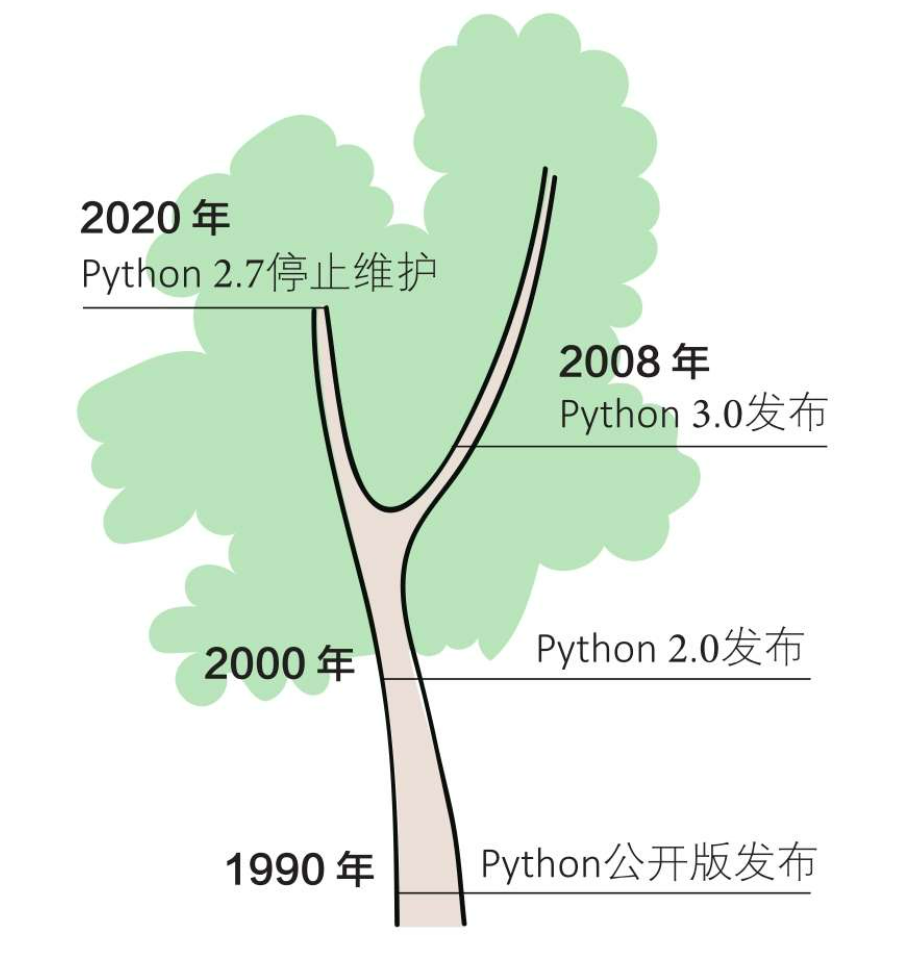
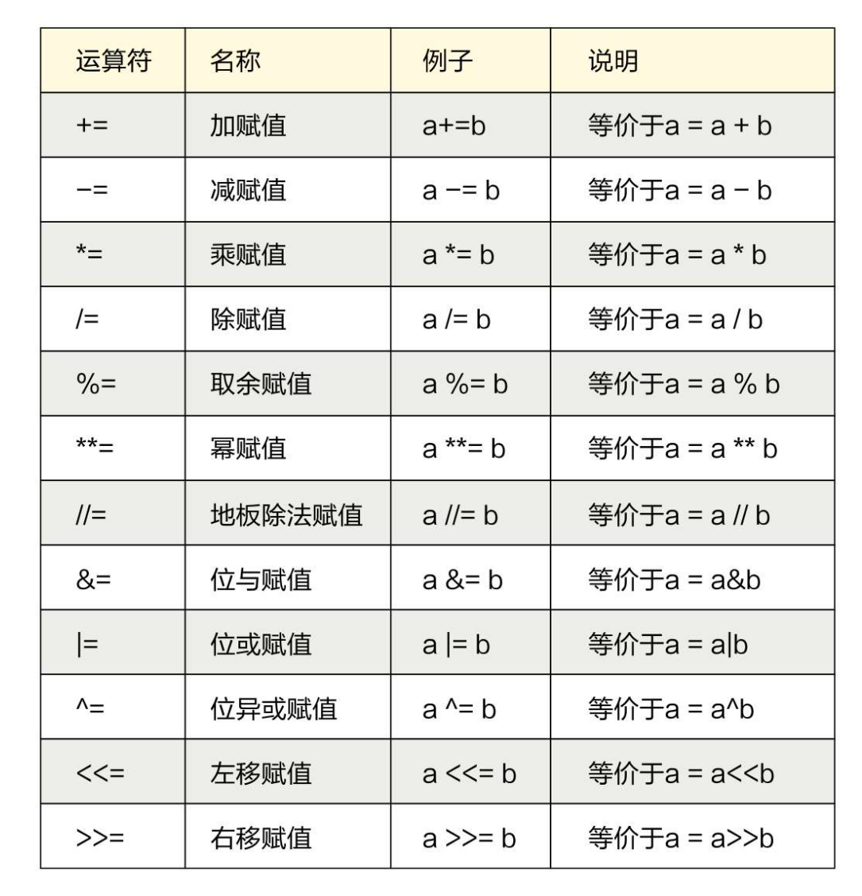

# 目录

[toc]

# 1. Python简介

Python 是著名的“龟叔” Guido van Rossum 在 1989 年圣诞节期间，为了打发无聊的圣诞节而编写的一个编程语言。国内社区通常将Guido van Rossum简称为“龟叔”，“龟”的发音取自Guido中的“Gui”。

Guido van Rossum 有一句著名的话就是 “**Life is short, you need Python**” ，译为： “ **人生苦短，我用**
**Python**” 。


Python的历史大致如下。目前通用的是python3版本。



Python 是高级编程语言，它有一个特点就是能快速的开发。Python 为我们提供了非常完善的基础代码库，覆盖了网络、文件、GUI、数据库、文本等大量内容，被形象地称作“内置电池（batteries included）”。用 Python 开发，许多功能不必从零编写，直接使用现成的即可。而且 Python 还能开发网站，多大型网站就是用 Python 开发的，例如 YouTube、Instagram，还有国内的豆瓣。很多大公司，包括 Google、Yahoo 等，甚至 NASA（美国航空航天局）都大量地使用 Python。

## Python 语言的特点

- 1 ）简单易学

  Python 语言简洁、优雅，相比其他程序语言（比如： Java ， C++ 等）， Python 语言更容易阅读和编写。 Python

  语言使用起来很有趣，且该语言更多的是专注于解决方案而不是语法本身。

  初学者学 Python ，不但入门容易，而且将来深入下去，可以编写那些非常非常复杂的程序。

- 2 ）开源且免费

  Python 是一门开源的编程语言，可以免费使用，甚至可以用于商业用途。当然，你也可以提交相关贡献代码。Python 有一个庞大的社区来维护并保持快速发展。

- 3 ）可移植性

  Python 是跨平台的编程语言，它可以运行在 windows 、 Mac 和各种 Linux/Unix 系统上。也就是说，假设在windows 系统下编写的 Python 程序，在 Mac 或 Linux 系统下也是可以运行的。

- 4 ）开发效率非常高

  Python 有非常强大的第三方库，基本上你想通过计算机实现任何功能， Python 官方库里都有相应的模块进行支持，直接下载调用后，在基础库的基础上再进行开发，大大降低开发周期，避免重复造轮子。

- 5 ）高级语言

  当你用 Python 语言编写程序的时候，你无需考虑诸如如何管理你的程序使用的内存以及垃圾回收一类的底层细节。

- 6 ）可扩展性

  如果你需要你的一段关键代码运行得更快或者希望某些算法不公开，你可以把你的部分程序用 C 或 C++ 编写，然后在你的 Python 程序中使用它们。

- 7 ）可嵌入性

  你可以把 Python 代码嵌入你的 C/C++ 程序，从而向你的程序用户提供脚本功能。

- 8 ）面向对象

  Python 中的一切都是对象。面向对象编程（ OOP ）可以帮助您直观地解决复杂的问题。有了 OOP ，你可以通过创建对象把这些复杂的问题划分成更小的集合。

当然，任何编程语言有有点，也有缺点，Python 也不例外。那么 Python 有哪些缺点呢？

- 第一个缺点就是运行速度慢，和C程序相比非常慢，因为Python是解释型语言，你的代码在执行时会一行一行地翻译成CPU能理解的机器码，这个翻译过程非常耗时，所以很慢。而C程序是运行前直接编译成CPU能执行的机器码，所以非常快。
- 第二个缺点就是代码不能加密。如果要发布你的 Python 程序，实际上就是发布源代码。像 JAVA , C 这些编译型的语言，都没有这个问题，而解释型的语言，则必须把源码发布出去。

## Python 语言的应用领域

Python 被广泛的应用于诸多领域，比如：
• 数据科学：数据科学涉及领域很广，涉及到当前火热的人工智能领域。 Python 的数据科学包括数据分析、数据
可视化、数据挖掘、自然语言处理、机器学习、深度学习等。典型的 Python 库有： Numpy ， Scipy ， Pandas ，Matplotlib ， Seaborn ， Scikit-learn ， tensorflow 等。
• 云计算：典型应用 ——Python 开发的 OpenStack
• WEB 开发：众多优秀的 WEB 框架，比如： Django 、 flask 、 tornado
• 网络爬虫：使用 Python 可以便捷的编写网络爬虫，从网页上爬取相关信息，常用的 Python 库包括： Requests ，BeautifulSoup ， Scrapy 等。
• 系统运维：运维人员必备， slatstack （系统自动化配置和管理工具）， Ansible （自动化运维工具）
• 图形界面开发： wxPython 、 PyQT 、 TKinter


# 2. Python的安装


## Windows下的安装

todo

## Linux下的安装

todo

# 3.第一个Python程序

```python
print('Hello Python')
```

在终端上运行下面的命令：

```shell
python hello.py
```

# 4.Python的注意事项

- 采用UTF-8 编码

  ```python
  #-*-coding:utf-8-*-
  ```

- 具有严格的缩进，Tab

- 大小写敏感

- 与C、C++不同，每一行代码的结尾不用分号；

- 注释：通过用自己熟悉的语言，在程序中对某些代码进行标注说明，这就是注释的作用，能够大大增强程序的可读性

  单行注释：

  以#单独一行开头，或者在一行代码后面注释

- 多行注释：

  ‘’‘ ---

  xxx

  -- ’‘’

# 类型提示

增加代码的可读性

```python
def get_full_name(first_name: str="hello", last_name: str="python")->str:
    full_name = first_name.title() + " " + last_name.title()
    return full_name

items: List[str]
items_t: Tuple[int, int, str], 
items_s: Set[bytes]
prices: Dict[str, float]
```

推荐使用：mypy 检查代码类型是否存在错误

安装：pip install mypy


# 5. Python 中的变量 #

## 1. 变量的创建和赋值 ##

在Python中为一个变量赋值的同时就声明了该变量，该变量的数据类型就是赋值数据所属的类型，该变量还可以接收其他类型的数据。

在 Python 程序中，变量是用一个变量名表示，可以是任意数据类型，变量名必须是大小写英文、数字和下划线（_）的组合，且不能用数字开头，比如：

```python
a = 88
b = 3.141
c = 'string'
d = ['a',123,12.13,[123,111]] # list
e = ('a',123,12.13,[123,111]) # tuple
```

- 这里的 `a` 就是一个变量，代表一个整数。

- 在 Python 中 `=` 是赋值语句，跟其他的编程语言也是一样的。

- 注意一点是 Python 是不用声明数据类型的，因此可以把任意的数据类型赋值给变量，且同一个变量可以反复赋值，而且可以是不同的数据类型。

- 可以使用type(变量的名字)，来查看变量的类型


## 2. 多个变量赋值 ##

Python 允许同时为多个变量赋值。例如：

```python
a = b = c = 1
```

以上实例，创建一个整型对象，值为 1，**三个变量被分配到相同的内存空间上**。

当然也可以为多个对象指定多个变量。例如：

```python
a, b, c = 1, 2, "liangdianshui"
```

以上实例，两个整型对象 1 和 2 的分配给变量 a 和 b，字符串对象 "liangdianshui" 分配给变量 c。

## 3. 命名规则

**驼峰命名**

- 小驼峰式命名法（lower camel case）： 第一个单词以小写字母开始；第二个单词的首字母大写，例如：myName、aDog

- 大驼峰式命名法（upper camel case）： 每一个单字的首字母都采用大写字母，例如：FirstName、LastName

- 不过在程序员中还有一种命名法比较流行，就是用下划线“_”来连接所有的单词，比如send_buf


## 4. 关键字

关键字，是python已经使用的了，所以不允许开发者自己定义和关键字相同的名字的标示符。

```python
 and     as      assert     break     class      continue    def     del
      elif    else    except     exec      finally    for         from    global
      if      in      import     is        lambda     not         or      pass
      print   raise   return     try       while      with        yield
```

可以通过以下命令进行查看当前系统中python的关键字:

```python
import keyword
keyworld.kwlist
```

# 6. 输入和输出

## 1. 输入

```python
# input()接受表达式输入，并把表达式的结果赋值给等号左边的变量
a = input('提示信息：')
```

- **返回字符串**
- 与int函数结合使用，为变量赋整数值。

- 与float函数结合使用，为变量赋浮点数值。

## 2. 格式化输出

```python
age = 18
name = "xiaohua"
print("我的姓名是%s,年龄是%d"%(name,age))
```

| 格式符号 |             转换             |
| :------: | :--------------------------: |
|    %c    |             字符             |
|    %s    | 通过str() 字符串转换来格式化 |
|    %i    |       有符号十进制整数       |
|    %d    |       有符号十进制整数       |
|    %u    |       无符号十进制整数       |
|    %o    |          八进制整数          |
|    %x    |   十六进制整数（小写字母）   |
|    %X    |   十六进制整数（大写字母）   |
|    %e    |     索引符号（小写'e'）      |
|    %E    |     索引符号（大写“E”）      |
|    %f    |           浮点实数           |
|    %g    |       ％f和％e 的简写        |
|    %G    |        ％f和％E的简写        |


# 7. 基本数据类型

整型（int）、浮点数（float）、字符串（string）、布尔值（boll）、空值(None)


## 整型

```python
a = 100
```


## 浮点数

```python
a = 100.1
```


## 复数类型

整数和浮点数（小数）在数学中被统称为实数。与实数对应的是复数，复数在数学中被表示为：a+bi，其中a被称为实部，b被称为虚部，i被称为虚数单位。复数在数学、理论物理学和电气工程等方面应用广泛，例如向量就可以使用复数表示。


## 字符串

string 使用‘ ’ 或者“ ”括起来的元素

### 字符串创建


字符串：双引号或者单引号中的数据

```python
str1 = "100"
str2 = "abc"
str3 = "a'b'c"
str4 = '''xxxxxxxxxxxxxxxx''' # 长字符串'
str5 = """xxxxxxxxxxxxxxxx""" # 长字符串"
print(str1)
print(str2)
print(str3)

>100
>abc
>a'b'c
```

### 字符串输出

```python
print("姓名：%s" % name)
```


### 格式化字符串输出format


### 字符串输入

```python
userName = input('请输入用户名:')
```

### 字符串索引

```python
name = 'abcdef'
print(name[0])
```


### 字符串切片

`切片`是指对操作的对象截取其中一部分的操作。**字符串、列表、元组**都支持切片操作。

**切片的语法**：[起始:结束:步长]

**注意：选取的区间属于左闭右开型，即从"起始"位开始，到"结束"位的前一位结束（不包含结束位本身)。**

我们以字符串为例讲解。

如果取出一部分字符串，则可以在中括号[]中使用:

```python
name = 'abcdef'
print(name[0:3]) # 取 下标0~2 的字符
```


### 字符串的常见操作

| 函数                                          | 说明                                                         |
| --------------------------------------------- | ------------------------------------------------------------ |
| mystr.find(str, start=0, end=len(mystr))      | 检测 str 是否包含在 mystr中，如果是返回开始的索引值，否则返回-1 |
| mystr.rfind(str, start=0,end=len(mystr) )     | 类似于 find()函数，不过是从右边开始查找.                     |
| mystr.index(str, start=0, end=len(mystr))     | str是否在mystr中                                             |
| mystr.rindex( str, start=0,end=len(mystr))    | 类似于 index()，不过是从右边开始.                            |
| mystr.count(str, start=0, end=len(mystr))     | 返回 str在start和end之间 在 mystr里面出现的次数              |
| mystr.replace(str1, str2,  mystr.count(str1)) | 把 mystr 中的 str1 替换成 str2,如果 count 指定，则替换不超过 count 次 |
| mystr.split(str=" ", 2)                       | 以 str 为分隔符切片 mystr，如果 maxsplit有指定值，则仅分隔 maxsplit 个子字符串 |
| mystr.capitalize()                            | 把字符串的第一个字符大写                                     |
| mystr.title()                                 | 把字符串的每个单词首字母大写                                 |
| mystr.startswith(obj)                         | 检查字符串是否是以 obj 开头, 是则返回 True，否则返回 False   |
| mystr.endswith(obj)                           | 检查字符串是否以obj结束，如果是返回True,否则返回 False.      |
| mystr.lower()                                 | 转换 mystr 中所有大写字符为小写                              |
| mystr.upper()                                 | 转换 mystr 中的小写字母为大写                                |
| mystr.ljust(width)                            | 返回一个原字符串左对齐,并使用空格填充至长度 width 的新字符串 |
| mystr.rjust(width)                            | 返回一个原字符串右对齐,并使用空格填充至长度 width 的新字符串 |
| mystr.center(width)                           | 返回一个原字符串居中,并使用空格填充至长度 width 的新字符串   |
| mystr.lstrip()                                | 删除 mystr 左边的空白字符                                    |
| mystr.rstrip()                                | 删除 mystr 字符串末尾的空白字符                              |
| mystr.strip()                                 | 删除mystr字符串两端的空白字符                                |
| mystr.partition(str)                          | 把mystr以str分割成三部分,str前，str和str后                   |
| mystr.rpartition(str)                         | 类似于 partition()函数,不过是从右边开始.                     |
| mystr.splitlines()                            | 按照行分隔，返回一个包含各行作为元素的列表                   |
| mystr.isalpha()                               | 如果 mystr 所有字符都是字母 则返回 True,否则返回 False       |
| mystr.isdigit()                               | 如果 mystr 只包含数字则返回 True 否则返回 False              |
| mystr.isalnum()                               | 如果 mystr 所有字符都是字母或数字则返回 True,否则返回 False  |
| mystr.isspace()                               | 如果 mystr 中只包含空格，则返回 True，否则返回 False.        |
| mystr.join(str)                               | mystr 中每个字符后面插入str,构造出一个新的字符串             |
| max(str)                                      | 返回字符串 *str* 中最大的字母。                              |
| min(str)                                      | 返回字符串 *str* 中最小的字母。                              |
| 加（+）                                       | 加（+）运算符可以将两个序列连接起来，                        |
| 乘（*）                                       | 乘（*）运算符可以将两个序列重复多次。                        |
| in                                            | 元素在str中返回True                                          |
| not in                                        | 元素不在str中返回True                                        |


## bool

Python 中，可以直接用 True、False 表示布尔值（请注意大小写）

False : 0,' ',[],{},

布尔值可以用 `and`、`or` 和 `not` 运算。


## 空值

在 Python 中，用 `None `来表示


## 转义字符

| 转义字符      | 描述                                                     |
| :------------ | :------------------------------------------------------- |
| \\\(在行尾时) | 续行符                                                   |
| \             | 反斜杠符号                                               |
| \'            | 单引号                                                   |
| \"            | 双引号                                                   |
| \a            | 响铃                                                     |
| \b            | 退格(Backspace)                                          |
| \e            | 转义                                                     |
| \000          | 空                                                       |
| \n            | 换行                                                     |
| \v            | 纵向制表符                                               |
| \t            | 横向制表符                                               |
| \r            | 回车                                                     |
| \f            | 换页                                                     |
| \oyy          | 八进制数，y 代表 0~7 的字符，例如：\012 代表换行。       |
| \xyy          | 十六进制数，以 \x 开头，yy代表的字符，例如：\x0a代表换行 |
| \other        | 其它的字符以普通格式输出                                 |

## 数据类型转换 ##

Python 中基本数据类型转换的方法有下面几个。

| 方法                   | 说明                                                  |
| ---------------------- | ----------------------------------------------------- |
| int(x [,base ])        | 将x转换为一个整数，可以指定进制                       |
| float(x )              | 将x转换到一个浮点数                                   |
| complex(real [,imag ]) | 创建一个复数                                          |
| str(x )                | 将对象 x 转换为字符串                                 |
| repr(x )               | 将对象 x 转换为表达式字符串                           |
| eval(str )             | 用来计算在字符串中的有效 Python 表达式,并返回一个对象 |
| tuple(s )              | 将序列 s 转换为一个元组                               |
| list(s )               | 将序列 s 转换为一个列表                               |
| chr(x )                | 将一个整数转换为一个字符                              |
| unichr(x )             | 将一个整数转换为 Unicode 字符                         |
| ord(x )                | 将一个字符转换为它的整数值                            |
| hex(x )                | 将一个整数转换为一个十六进制字符串                    |
| oct(x )                | 将一个整数转换为一个八进制字符串                      |

比如 `int()` 函数，将符合规则的字符串类型转化为整数 。

```python
str1 = "100"
str2 = "200"
print(str1 + str2)
print(int(str1) + int(str2))

>100200
>300
```

type(<object>)用于判断对象的类型，返回结果可为str、int、float、list等。


## 算术运算符

下面以a=10 ,b=20为例进行计算

| 运算符 |  描述  | 实例                                                         |
| :----- | :----: | ------------------------------------------------------------ |
| +      |   加   | 两个对象相加 a + b 输出结果 30                               |
| -      |   减   | 得到负数或是一个数减去另一个数 a - b 输出结果 -10            |
| *      |   乘   | 两个数相乘或是返回一个被重复若干次的字符串 a * b 输出结果 200 |
| /      |   除   | x除以y b / a 输出结果 2                                      |
| %      |  取余  | 返回除法的余数 b % a 输出结果 0                              |
| **     |   幂   | 返回x的y次幂 a**b 为10的20次方， 输出结果 100000000000000000000 |
| //     | 取整除 | 返回商的整数部分 9//2 输出结果 4 , 9.0//2.0 输出结果 4.0     |

## 赋值运算符



## 关系运算符

python中的比较运算符如下表

| 运算符 | 描述                                                         | 示例                                              |
| :----- | :----------------------------------------------------------- | :------------------------------------------------ |
| ==     | 检查两个操作数的值是否相等，如果是则条件变为真。             | 如a=3,b=3则（a == b) 为 true.                     |
| !=     | 检查两个操作数的值是否相等，如果值不相等，则条件变为真。     | 如a=1,b=3则(a != b) 为 true.                      |
| <>     | 检查两个操作数的值是否相等，如果值不相等，则条件变为真。     | 如a=1,b=3则(a <> b) 为 true。这个类似于 != 运算符 |
| >      | 检查左操作数的值是否大于右操作数的值，如果是，则条件成立。   | 如a=7,b=3则(a > b) 为 true.                       |
| <      | 检查左操作数的值是否小于右操作数的值，如果是，则条件成立。   | 如a=7,b=3则(a < b) 为 false.                      |
| >=     | 检查左操作数的值是否大于或等于右操作数的值，如果是，则条件成立。 | 如a=3,b=3则(a >= b) 为 true.                      |
| <=     | 检查左操作数的值是否小于或等于右操作数的值，如果是，则条件成立。 | 如a=3,b=3则(a <= b) 为 true.                      |


## 逻辑运算符

`and` 运算是与运算，只有所有都为 True，and 运算结果才是 True。

`or` 运算是或运算，只要其中有一个为 True，or 运算结果就是 True。

`not` 运算是非运算，它是一个单目运算符，把 True 变成 False，False 变成 True。


## 位运算符

位运算是以二进位（bit）为单位进行运算的，操作数和结果都是整数类型的数据。


## 运算符的优先级


### 可更改(mutable)与不可更改(immutable)对象

在 python 中，strings, tuples, 和 numbers 是不可更改的对象，而 list,dict 等则是可以修改的对象。

- **不可变类型：**变量赋值 **a=5** 后再赋值 **a=10**，这里实际是新生成一个 int 值对象 10，再让 a 指向它，而 5 被丢弃，不是改变 a 的值，相当于新生成了 a。
- **可变类型：**变量赋值 **la=[1,2,3,4]** 后再赋值 **la[2]=5** 则是将 list la 的第三个元素值更改，本身la没有动，只是其内部的一部分值被修改了。


# 判断语句和循环语句


## If语句

`注意`：第一行后面的冒号“:”

### if

```python
if 条件1:
	语句1
```


###  if-else

```python
if 条件1:
	语句1
else:
	语句2
```

### if--elif-else

```python
if 条件1:
   语句1
elif 条件2:
   语句2
else:
   语句3
```

### if嵌套

```python
if 条件1:
	语句1
    if 条件2:
		语句2 
```


## while循环

```python
while 条件1:
        条件满足时，做的事情1
```


## for循环

for循环可以遍历任何序列的项目，如一个string，list ，tuple，set或者dict等。

```python
for 变量 in 可迭代对象:
    语句
```


## break、continue和pass

- break的作用：用来结束整个循环
- continue的作用：用来结束本次循环，紧接着执行下一次的循环
- break/continue只能用在循环中，除此以外不能单独使用
- break/continue在嵌套循环中，只对最近的一层循环起作用
- pass是空语句，是为了保持程序结构的完整性。pass 不做任何事情，一般用做占位语句

## 遍历

### enumerate()

```python
for index, item in enumerate(sequence):
    process(index, item)
```

### range()

如果你需要遍历数字序列，可以使用内置range(start,end,step)函数。它会生成数列

```python
for i in range(5,9) :   
	 print(i)
```


# List #


## 1. 什么是 List 

List （列表）是 Python 内置的一种数据类型，类似于C/C++的数组。 它是一种有序的集合，可以随时添加和删除其中的元素。


## 2. 创建 List ##

从上面的例子可以分析出，列表的格式是这样的。

其实列表就是用**中括号 `[]`** 括起来的数据，里面的每一个数据就叫做元素。每个元素之间使用逗号分隔。

**列表的数据元素可以是不同的数据类型**。

比如：

```python
list = []
list1 = ['两点水','twowter','liangdianshui',123]
list('hello')
list(tuple1)
```

**列表的嵌套**

一个列表中的元素又是一个列表，那么这就是列表的嵌套

```python
schoolNames = [['北京大学','清华大学'],
	['南开大学','天津大学','天津师范大学'],
	['山东大学','中国海洋大学']]
#二维列表的索引
value = schoolNames[1][1]
```

## 3. 访问list

```python
a = list[n]  #访问列表的第n个元素
a = list[-n]  #访问列表的倒数第n个元素
# list的切片
b= list[start:end:step]  #访问列表的[start，end）元素
```


## 4. 修改list

```python
list[index] = obj       # 重新赋值
list.append(obj)        #在列表末尾添加新的对象                                      
list.extend(seq)        #在列表末尾一次性追加另一个序列中的多个值（用新列表扩展原来的列表） 
list.insert(index, obj) #将对象插入列表指定位置                                           
```


## 5. 删除list

```python
list.pop(obj=list[-1])  #移除列表中的一个元素（默认最后一个元素），并且返回该元素的值
del list[index]  		#删除列表的某个元素                 
list.remove(obj)  		#根据元素的值删除第一个匹配项,并且不返回任何值 
```


## 6. List运算符 ##

列表对 `+`  和 `*`  的操作符与字符串相似。`+` 号用于组合列表，`*`  号用于重复列表。

| Python 表达式                  | 结果                         | 描述                 |
| ------------------------------ | ---------------------------- | -------------------- |
| [1, 2, 3] + [4, 5, 6]          | [1, 2, 3, 4, 5, 6]           | 组合                 |
| ['Hi!'] * 4                    | ['Hi!', 'Hi!', 'Hi!', 'Hi!'] | 复制                 |
| 3 **in** [1, 2, 3]、**not in** | True                         | 元素是否存在于列表中 |
| for x in [1, 2, 3]: print x,   | 1 2 3                        | 迭代循环遍历         |


## 7. List 常用的函数 ##

| 函数&方法         | 描述                                                         |
| ----------------- | ------------------------------------------------------------ |
| len(list)         | 列表元素个数                                                 |
| max(list)         | 返回列表元素最大值                                           |
| min(list)         | 返回列表元素最小值                                           |
| list(seq)         | 将元组转换为列表                                             |
| list.count(obj)   | 统计某个元素在列表中出现的次数                               |
| list.index(obj)   | 从列表中找出某个值第一个匹配项的索引位置                     |
| list.reverse()    | 反向列表中元素                                               |
| list.sort([func]) | 按特定顺序重新排列，默认为由小到大，参数reverse=True可改为倒序，由大到小。 |

## 8. 列表推导式

列表推导式的一般语法结构：

```python
new_list = [x for x in iterable]

str_list = [x.lower() for x in "Lemon"]

list_list = [x**2 for x in [1,2,3,4]]

tuple_list = [x+2 for x in (1,2,3,4)]

ge_list = [x for x in range(8)]

两层 for 循环的列表推导式
[x**2+y for x in range(5) for y in range(4,7)]

使用两个或多个变量来生成 list ，结合字典的使用，举例如下：
d = {'x': '1', 'y':'2', 'z':'4'}
d_list = [k+'='+v for k,v in d.items()]

列表推导式中还可以引入 if 条件语句，如下：
if_list = [x**2 for x in range(10) if x%2==0]

包含 if-else 语句的列表推导式
[x**2 if x%2==0 else x+2 for x in range(10)]

包含两个 if 语句的列表推导式
[x**2 for x in range(10) if x%2==0 if x%3==0]


```


# tuple #


## 1、什么是tuple ##

上一节刚说了一个有序列表 List ，现在说另一种有序列表叫**元组**：tuple 。

tuple 和 List 非常类似，但是 **tuple 一旦初始化就不能修改**。

元组（tuple） 不可变是指当你创建了 tuple 时候，它就不能改变了，也就是说它也没有 append()，insert() 这样的方法，但它也有获取某个索引值的方法，但是不能赋值。

那么为什么要有 tuple 呢？

那是因为 tuple 是不可变的，所以代码更安全。

所以建议能用 tuple 代替 list 就尽量用 tuple 。


## 2、创建tuple ##

元组创建很简单，只需要在括号**`()`**中添加元素，并使用逗号隔开即可。

```python
tuple1=('两点水','twowter','liangdianshui',123,456)
tuple(list1)
tuple('hello')
```

创建空元组

```python
tuple3=()
```

**元组中只包含一个元素时，需要在元素后面添加逗号**

```python
tuple4=(123,)
```

如果不加逗号，创建出来的就不是 元组（tuple），而是指 ```123``` 这个数了。


这是因为括号 () 既可以表示元组（tuple），又可以表示数学公式中的小括号，这就产生了歧义。


## 3、访问tuple ##

元组下标索引也是从 0 开始，元组（tuple）可以使用下标索引来访问元组中的值。

```python
#-*-coding:utf-8-*-
tuple1=('两点水','twowter','liangdianshui',123,456)
tuple2='两点水','twowter','liangdianshui',123,456

print(tuple1[1])
print(tuple2[0])
```


## 4、修改tuple ##

可能看到这个小标题有人会疑问，上面不是花了一大段来说 tuple 是不可变的吗？

这里怎么又来修改 tuple （元组） 了。

那是因为元组中的元素值是不允许修改的，但我们可以对元组进行连接组合，还有通过**修改其他列表的值从而影响 tuple 的值。**

具体看下面的这个例子：

```python
#-*-coding:utf-8-*-
list1=[123,456]
tuple1=('两点水','twowater','liangdianshui',list1)
print(tuple1)
list1[0]=789
list1[1]=100
print(tuple1)
```

输出的结果：

```
('两点水', 'twowater', 'liangdianshui', [123, 456])
('两点水', 'twowater', 'liangdianshui', [789, 100])
```


可以看到，两次输出的 tuple 值是变了的。我们看看 tuple1 的存储是怎样的。


可以看到，tuple1 有四个元素，最后一个元素是一个 List ，List 列表里有两个元素。

当我们把 List 列表中的两个元素 `124` 和 `456` 修改为 `789` 和 `100` 的时候，从输出来的 tuple1 的值来看，好像确实是改变了。

但其实变的不是 tuple 的元素，而是 list 的元素。

tuple 一开始指向的 list 并没有改成别的 list，所以，tuple 所谓的“不变”是说，tuple 的每个元素，指向永远不变。注意是 tupe1 中的第四个元素还是指向原来的 list ，是没有变的，我们修改的只是列表 List 里面的元素。


## 5、删除 tuple ##

tuple 元组中的元素值是不允许删除的，但我们可以使用 del 语句来删除整个元组

```python
#-*-coding:utf-8-*-

tuple1=('两点水','twowter','liangdianshui',[123,456])
print(tuple1)
del tuple1
```


## 6、tuple运算符 ##

与字符串一样，元组之间可以使用 `+` 号和 `*` 号进行运算。这就意味着他们可以组合和复制，运算后会生成一个新的元组。

| Python 表达式                 | 结果                         | 描述         |
| ----------------------------- | ---------------------------- | ------------ |
| (1, 2, 3) + (4, 5, 6)         | (1, 2, 3, 4, 5, 6)           | 连接         |
| ('Hi!',) * 4                  | ('Hi!', 'Hi!', 'Hi!', 'Hi!') | 复制         |
| 3 in (1, 2, 3)                | True                         | 元素是否存在 |
| for x in (1, 2, 3):  print(x) | 1 2 3                        | 迭代         |


## 7、元组内置函数 ##

| 方法                        | 描述                    |
| --------------------------- | ----------------------- |
| len(tuple1)                 | 计算元组元素个数        |
| max(tuple1)                 | 返回元组中元素最大值    |
| min(tuple1)                 | 返回元组中元素最小值    |
| tuple(seq)                  | 将列表转换为元组        |
| tuple1.index(obj,strat,end) | obj在tuple1中的索引     |
| tuple1.count(obj)           | tuple1中obj的元素的个数 |


# dict

## 1. 什么是dict 字典

字典是另一种可变容器模型，且可存储任意类型对象。

字典的每个键值 **key:value** 对用冒号 **:** 分割，每个键值对之间用逗号 **,** 分割，整个字典包括在花括号 **{}** 中 ,格式如下所示：

```python
d = {key1 : value1, key2 : value2 }
```


- 字典中找某个元素时，是根据`key`来进行查找的
- 字典里的元素没有顺序
- 字典里的`key`不能重复，`value`可以重复，如果重复最后的一个键值对会替换前面的，值不需要唯一。
- `value`可以取任何数据类型，但`key`必须是不可变的，如string，数字或tuple（list不可以）。


## 2. 创建dict

```python
tinydict1 = { 'abc': 456 }
tinydict2 = { 'abc': 123, 98.6: 37 }
```


## 3. 访问dict

把相应的键放入熟悉的方括弧，如下:

```python
tinydict = {'Name': 'Zara', 'Age': 7, 'Class': 'First'}  
tinydict['Name'] 
tinydict['Age']
```

- 如果用dict里没有的`key`访问数据，会输出错误
- dict1.get(key1) # 获取不存在的key1，获取到空的内容，不会出现异常


## 4. 修改dict

向字典添加新内容的方法是增加新的键/值对

```python
tinydict = {'Name': 'Zara', 'Age': 7, 'Class': 'First'}
tinydict['Age'] = 8 # 更新
tinydict['School'] = "RUNOOB" # 添加
```


## 5. 删除dict

```python
tinydict = {'Name': 'Zara', 'Age': 7, 'Class': 'First'}
 
del tinydict['Name']  # 删除键是'Name'的条目
tinydict.clear()      # 清空字典所有条目
del tinydict          # 删除字典
```


## 6. 字典内置函数&方法

Python字典包含了以下内置函数：

| 序号 | 函数                | 描述                                             |
| :--- | :------------------ | ------------------------------------------------ |
| 1    | cmp(dict1, dict2）  | 比较两个字典元素                                 |
| 2    | len(dict1)          | 计算字典元素个数，即键的总数                     |
| 3    | str(dict1)          | 输出字典可打印的字符串表示                       |
| 4    | type(variable)      | 返回输入的变量类型，如果变量是字典就返回字典类型 |
| 5    | dict1.keys()        | 返回一个包含字典所有key的列                      |
| 6    | dict1.values()      | 返回一个包含字典所有value的列表                  |
| 7    | dict1.items()       | 返回一个包含所有（键，值）元祖的列表             |
| 8    | dict1.has_key(key1) | 如果key在字典中，返回True，否则返回False         |

Python字典包含了以下内置方法：

| 序号 | 函数及描述                                                   |
| :--- | :----------------------------------------------------------- |
| 1    | dict.clear()删除字典内所有元素                               |
| 2    | dict.copy()返回一个字典的浅复制                              |
| 3    | [dict.fromkeys(seq[, val])创建一个新字典，以序列 seq 中元素做字典的键，val 为字典所有键对应的初始值 |
| 4    | [dict.get(key, default=None)](https://www.runoob.com/python/att-dictionary-get.html) 返回指定键的值，如果值不在字典中返回default值 |
| 5    | [dict.has_key(key)](https://www.runoob.com/python/att-dictionary-has_key.html) 如果键在字典dict里返回true，否则返回false |
| 6    | [dict.items()](https://www.runoob.com/python/att-dictionary-items.html) 以列表返回可遍历的(键, 值) 元组数组 |
| 7    | [dict.keys()](https://www.runoob.com/python/att-dictionary-keys.html) 以列表返回一个字典所有的键 |
| 8    | [dict.setdefault(key, default=None)](https://www.runoob.com/python/att-dictionary-setdefault.html) 和get()类似, 但如果键不存在于字典中，将会添加键并将值设为default |
| 9    | [dict.update(dict2)](https://www.runoob.com/python/att-dictionary-update.html) 把字典dict2的键/值对更新到dict里 |
| 10   | [dict.values()](https://www.runoob.com/python/att-dictionary-values.html) 以列表返回字典中的所有值 |
| 11   | [pop(key[,default\])](https://www.runoob.com/python/python-att-dictionary-pop.html) 删除字典给定键 key 所对应的值，返回值为被删除的值。key值必须给出。 否则，返回default值。 |
| 12   | [popitem()](https://www.runoob.com/python/python-att-dictionary-popitem.html) 返回并删除字典中的最后一对键和值。 |


# set

## 1. 什么是set

集合（set）是一种可迭代的、无序的、不能包含重复元素的容器类型的数据。

## 2. 创建set

我们可以通过以下两种方式创建集合。
1 set（iterable）函数：参数iterable是可迭代对象（字符串、列表、元组、集合和字典等）。
2 {元素1，元素2，元素3，⋯}：指定具体的集合元素，元素之间以逗号分隔。对于集合元素，需要使用大括号括起来。


## 3. 修改集合

修改集合类似于修改列表，可以向其中插入和删除元素。修改可变集合有如右所示的常用方法。
set1.add(elem)：添加元素，如果元素已经存在，则不能添加，不会
抛出错误。
set1.remove(elem)：删除元素，如果元素不存在，则抛出错误。
set1.clear()：清除集合。

# 迭代器与生成器

## 迭代器

- 迭代器对象从集合的第一个元素开始访问，直到所有的元素被访问完结束。迭代器只能往前不会后退。

- 迭代器有两个基本的方法：**iter()** 和 **next()**。

- 字符串，列表或元组对象都可用于创建迭代器

```python
list=[1,2,3,4]
>>> it = iter(list)   # 创建迭代器对象
>>> print(next(it))  # 输出迭代器的下一个元素
1
>>> print(next(it))
2

#使用常规for语句进行遍历
list=[1,2,3,4]
it = iter(list)    # 创建迭代器对象
for x in it:
    print (x, end=" ")
```


## 生成器

在 Python 中，使用了 yield 的函数被称为生成器（generator）。

跟普通函数不同的是，生成器是一个返回迭代器的函数，只能用于迭代操作，更简单点理解生成器就是一个迭代器。

在调用生成器运行的过程中，每次遇到 yield 时函数会暂停并保存当前所有的运行信息，返回 yield 的值, 并在下一次执行 next() 方法时从当前位置继续运行。

调用一个生成器函数，返回的是一个迭代器对象。

```python
import sys  
def fibonacci(n): # 生成器函数 - 斐波那契    
    a, b, counter = 0, 1, 0    
    while True:        
        if (counter > n):             
            return       
        yield a #输出a的值       
        a, b = b, a + b        
        counter += 1 
f = fibonacci(10) # f 是一个迭代器，由生成器返回生成  
while True:    
    try:        
        print (next(f), end=" ")    
    except StopIteration:        
        sys.exit()

#执行以上程序，输出结果如下：
>>> 0 1 1 2 3 5 8 13 21 34 55
```

1. yield 把函数变成了一个生成器。
2. 生成器函数的执行过程看起来就是不断地 执行->中断->执行->中断 的过程。
3. 一开始，调用生成器函数的时候，函数不会立即执行，而是返回一个生成器对象；
4. 然后，当我们使用 next() 作用于它的时候，它开始执行，遇到 yield 语句的时候，执行被中断，并返回当前的迭代值，要注意的是，此刻会记住中断的位置和所有的数 据，也就是执行时的上下文环境被保留起来；
5. 当再次使用 next() 的时候，从原来中断的地方继续执行，直至遇到 yield ，如果没有 yield ，则抛出异常。


### StopIteration

StopIteration 异常用于标识迭代的完成，防止出现无限循环的情况，在 __next__() 方法中我们可以设置在完成指定循环次数后触发 StopIteration 异常来结束迭代。


# 函数

函数是组织好的，可重复使用的，用来实现单一，或相关联功能的代码段。

函数能提高应用的模块性，和代码的重复利用率。你已经知道Python提供了许多内建函数，比如print()。但你也可以自己创建函数，这被叫做用户自定义函数。

## 函数的定义

你可以定义一个由自己想要功能的函数，以下是简单的规则：

- 函数代码块以 **def** 关键词开头，后接函数标识符名称和圆括号 **()**。
- 任何传入参数和自变量必须放在圆括号中间，圆括号之间可以用于定义参数。
- 函数的第一行语句可以选择性地使用文档字符串—用于存放函数说明。
- 函数内容以冒号 **:** 起始，并且缩进。
- **return [表达式]** 结束函数，选择性地返回一个值给调用方，不带表达式的 return 相当于返回 None。


## 函数的语法

Python 定义函数使用 def 关键字，一般格式如下：

```python
def 函数名（参数列表）:
    函数体
```

默认情况下，参数值和参数名称是按函数声明中定义的顺序匹配起来的。

## 函数的定义和调用

形式参数：定义的时候的参数(局部变量)

实际参数：函数调用时传入的参数

```python
def hello() :
  print("Hello World!")

hello() # 函数的调用
```

```python
def max(a, b): # 形式参数
    if a > b:
        return a
    else:
        return b
a = 4 # 实际参数
b = 5
print(max(a, b)) # 函数的调用
```


```python
def area(width, height):
    return width * height
 
def print_welcome(name):
    print("Welcome", name)
 
w = 4
h = 5
print("width =", w, " height =", h, " area =", area(w, h)) # 函数的调用
```


##  函数的参数传递

### 参数的类型

- **不可变类型：**类似 C++ 的值传递，如整数、字符串、元组。如 fun(a)，传递的只是 a 的值，没有影响 a 对象本身。如果在 fun(a) 内部修改 a 的值，则是新生成一个 a 的对象。
- **可变类型：**类似 C++ 的引用传递，如 列表，字典。如 fun(la)，则是将 la 真正的传过去，修改后 fun 外部的 la 也会受影响

python 中一切都是对象，严格意义我们不能说值传递还是引用传递，我们应该说传不可变对象和传可变对象。


### 必需参数

**必需参数须以正确的顺序传入函数**。调用时的数量必须和声明时的一样。


### 关键字参数

关键字参数和函数调用关系紧密，函数调用使用关键字参数来确定传入的参数值。

使用关键字参数**允许函数调用时参数的顺序与声明时不一致**，因为 Python 解释器能够用参数名匹配参数值。

位置参数必须在关键字参数之前

```python
def printinfo( name, age ):  
    "打印任何传入的字符串"   
    print ("名字: ", name)   
    print ("年龄: ", age)   
    return  #调用printinfo函数 
printinfo( age=50, name="runoob" )
```


### 默认参数

把默认参数放到后面

```python
def printinfo( name, age = 35 ):   
"打印任何传入的字符串"   
	print ("名字: ", name)   
    print ("年龄: ", age)   
    return  #调用printinfo函数 

printinfo( age=50, name="runoob" ) 
print ("------------------------") printinfo( name="runoob" )
```


### 不定长参数

- 加了星号 ***** 的参数会以**元组(tuple)**的形式导入，存放所有未命名的变量参数。

如果在函数调用时没有指定参数，它就是一个空元组。我们也可以不向函数传递未命名的变量。

```python
def functionname([formal_args,] *var_args_tuple ):
   "函数_文档字符串"
   function_suite
   return [expression]
```


- 加了两个星号 ***\*** 的参数会以**字典**的形式导入，基本语法如下：


```python
def functionname([formal_args,] **var_args_dict ):
   "函数_文档字符串"
   function_suite
   return [expression]

functionname(a=1,b=2,c=3)
```


声明函数时，参数中星号 ***** 可以单独出现，例如:

```python
def f(a,b,*,c):
    return a+b+c
```

如果单独出现星号 *****，则星号 ***** 后的参数必须用关键字传入


声明函数时，参数中星号 ***** 可以单独出现，例如:

```python
def f(a,b,/,c):
    return a+b+c
```

如果单独出现星号/，则星号 **/** 前的参数必须用位置参数传入

### 变量的作用域

局部变量：函数内部定义的变量

全局变量：函数外部定义的变量

可以使用global x，将函数提升为全局变量

函数中局部变量能够覆盖同名的全局变量

nonelocal：声明的变量不是局部变量,也不是全局变量,而是外部嵌套函数内的变量

**LEGB**

## 过滤函数filter

filter(function,iterable)

参数function是一个提供过滤条件的函数，返回布尔值。
参数iterable是容器类型的数据。

```python
def f1 (x):
    return x>50

data1 = [10,20,33,44,55,60]
filtered = filter(f1, data1)
data2 = list(filtered)
print(data2)

>>>[55,60]
```


## 映射函数map

map()函数用于对容器中的元素进行映射（或变换）。

用法：map(function,iterable)

参数function是一个提供变换规则的函数，返回变换之后的元素。
参数iterable是容器类型的数据。

例如：我想将列表中的所有元素都乘以2，返回新的列表。

```python
def f1 (x):
    return x*2

data1 = [10,20,33,44,55,60]
mapped = map(f1, data1)
data2 = list(mapped)
print(data2)

>>>[20, 40, 66, 88, 110, 120]
```


## 匿名函数lambda

Python 使用 **lambda** 来创建匿名函数。

所谓匿名，意即不再使用 **def** 语句这样标准的形式定义一个函数。

- **lambda** 只是一个表达式，函数体比 **def** 简单很多。

- lambda 的主体是一个表达式，而不是一个代码块。仅仅能在 lambda 表达式中封装有限的逻辑进去。

- lambda 函数拥有自己的命名空间，且不能访问自己参数列表之外或全局命名空间里的参数。

- 虽然 lambda 函数看起来只能写一行，却不等同于 C 或 C++ 的内联函数，后者的目的是调用小函数时不占用栈内存从而增加运行效率。

  

lambda 函数的语法只包含一个语句，如下：

```python
lambda [arg1 [,arg2,.....argn]]:expression
```

设置参数 a 加上 10:

```python
x = lambda a : a + 10 
print(x)
>>>15
```


以下实例匿名函数设置两个参数：

```python
#可写函数说明 
sum = lambda arg1, arg2: arg1 + arg2  # 调用sum函数 
print ("相加后的值为 : ", sum( 10, 20 )) 
print ("相加后的值为 : ", sum( 20, 20 ))

>>>相加后的值为 :  30
>>>相加后的值为 :  40
```


我们可以将匿名函数封装在一个函数内，这样可以使用同样的代码来创建多个匿名函数。

```python
data1 = [10,20,33,44,55,60]

filtered = filter(lambda x:(x>50),data1)
data2 = list(filtered)
print(data2)

mapped = map(lambda x:(x*2), data1)
data3 = list(mapped)
print(data3)

>>>[55, 60]
>>>[20, 40, 66, 88, 110, 120]
```


## 闭包

在一些语言中，在函数中可以（嵌套）定义另一个函数时，如果内部的函数引用了外部的函数的变量，则可能产生闭包。闭包可以用来在一个函数与一组“私有”变量之间创建关联关系。在给定函数被多次调用的过程中，这些私有变量能够保持其持久性。

```py
#返回函数funB

def funA():
    a = 100
    def funB():
        print(a)
    return funB

#第1种
funA()()

#第2种
funny = funA()
funny()

>> 100
```


```py
def power(exp):
    def exp_of(base):
        return base ** exp
    return exp_of

square = power(2)
cube = power(3)

print(square(5))
>> 25

print(cube(3))
>>27
```


## 装饰器

装饰器本质上是一个Python函数(其实就是闭包)，它可以让其他函数在不需要做任何代码变动的前提下增加额外功能，装饰器的返回值也是一个函数对象。装饰器用于有以下场景，比如:**插入日志、性能测试、事务处理、缓存、权限校验**等场景。

**使用：@**

**无参装饰器模板**

```python
def outter(func):
    def wrapper(*args, **kwargs):
		res = func(*args, **kwargs)
		return res

return wrapper

# 为函数添加一个统计运行时长的功能以及日志记录功能
import time
import threading

def how_much_time(func):
    print("1 how_much_time函数开始了")
    def inner():
        t_start = time.time()
        func()
        t_end = time.time()
        print("5 一共花费了{0}秒时间".format(t_end - t_start, ))
    return inner

def mylog(func):
    print("2 mylog函数开始了")
    def inner_1():
        print("3 start")
        func()
        print("6 end")
    return inner_1

@mylog
@how_much_time
# 等价于mylog(how_much_time(sleep_5s))
def sleep_2s():
    time.sleep(2)
    print("4 %d秒结束了" % (2,))

if __name__ == '__main__':
    sleep_2s()

# 1 how_much_time函数开始了
# 2 mylog函数开始了
# 3 start
# 4 2秒结束了
# 5 一共花费了2.0135462284088135秒时间
# 6 end
```


**有参装饰器模板**

```python
def deractor(args):
	def deco(func):
    	def wrapper(*args,**kwargs):
        编写基于文件的认证,认证通过则执行res=func(*args,**kwargs),并返回res
   		return wrapper
    return deco

import time
def logger(msg):
    def time_master(func):
        def call_func():
            start = time.time()
            func()
            stop = time.time()
            print(f'[{msg}]一共耗费了{(stop-start):.2f}')
        return call_func
    return time_master

def funA():
    time.sleep(1)
    print('正在调用funA')

funA = logger(msg='A')(funA)
funA()
# 正在调用funA
# [A]一共耗费了1.01
```


## 递归

函数自己调用自己

**汉诺塔**

```python
def hanoi(n, source, destination, spare):
    if n >= 1:
        # Step 1: Move the n - 1 disks from the source peg 
        # to the spare peg, using the destination as a spare
        hanoi(n - 1, source, spare, destination)

        # Step 2: Move the nth disk from the source peg 
        # to the destination peg 
        print("Move disk", n, "from peg", source, "to peg", destination)

        # Step 3: Move the n - 1 disks from the spare peg 
        # to the destination peg, using the source as a spare
        hanoi(n - 1, spare, destination, source)

    # Driver code
n = int(input('请输入汉诺塔的层数：'))
hanoi(n, 'A', 'C', 'B')

# A, B and C are the source, spare and destination pegs 
# respectively. 

```

## 高阶函数

装饰器、map、filter、min、max、

**functools**库

```python
import functools
def add(x,y):
    return x+y
print(functools.reduce(add,[1,2,3,4,5]))
```

## 偏函数

把一个函数的某些参数给固定住，返回一个新的函数

```
import functools
int2 = functools.partial(int, base=2)
print(int2('1000000'))
print(int2('1010101'))

>>>64
>>>85
```


## @warps

1，**name**:获取函数名称并显示
2，**doc**:获取文档说明并显示

Python 装饰器（decorator）在实现的时候，被装饰后的函数其实已经是另外一个函数了（函数名等函数属性会发生改变）
@ 符号是装饰器的语法糖。它放在一个函数开始定义的地方（头顶），和这个函数绑定在一起。
当我们调用这个函数的时候，会先将这个函数做为参数传入它头顶，即装饰器里
当添加上装饰器@warps后，m.__name__返回的是m()的函数名称，而不是装饰器warpps的函数名称。

## itertools.product

```
import itertools
aa = itertools.product(['西藏','瀑布','湖水'], ['月色','星空'])
bb = list(aa)   #按照顺序生成笛卡尔积，repeat默认是1
print(bb)
```


# 类与对象

## 什么是类和对象

- **类(Class):** 用来描述具有相同的属性和方法的对象的集合。它定义了该集合中每个对象所共有的属性和方法。对象是类的实例。
- **方法：**类中定义的函数。
- **类变量：**类变量在整个实例化的对象中是公用的。类变量定义在类中且在函数体之外。类变量通常不作为实例变量使用。
- **数据成员：**类变量或者实例变量用于处理类及其实例对象的相关的数据。
- **方法重写：**如果从父类继承的方法不能满足子类的需求，可以对其进行改写，这个过程叫方法的覆盖（override），也称为方法的重写。
- **局部变量：**定义在方法中的变量，只作用于当前实例的类。
- **实例变量：**在类的声明中，属性是用变量来表示的，这种变量就称为实例变量，实例变量就是一个用 self 修饰的变量。
- **继承：**即一个派生类（derived class）继承基类（base class）的字段和方法。继承也允许把一个派生类的对象作为一个基类对象对待。例如，有这样一个设计：一个Dog类型的对象派生自Animal类，这是模拟"是一个（is-a）"关系（例图，Dog是一个Animal）。
- **实例化：**创建一个类的实例，类的具体对象。
- **对象：**通过类定义的数据结构实例。对象包括两个数据成员（类变量和实例变量）和方法。


## 定义类

```python
class 类名：
	类体
```


## 创建对象

```python
class MyClass:    
    """一个简单的类实例"""    
    i = 12345  
    
    def f(self):        
        return 'hello world'  
    # 实例化类 
x = MyClass()  
# 访问类的属性和方法 
print("MyClass 类的属性 i 为：", x.i) 
print("MyClass 类的方法 f 输出为：", x.f())

>>>MyClass 类的属性 i 为： 12345
>>>MyClass 类的方法 f 输出为： hello world
```


```python
class Complex:    
    def __init__(self, realpart, imagpart):        
        self.r = realpart        
        self.i = imagpart 
        
x = Complex(3.0, -4.5) 
print(x.r, x.i)   # 输出结果：3.0 -4.5
```

self代表类的实例，而非类

## 构造方法

`__init__()`

类中的__init__（）方法是一个非常特殊的方法，用来创建和初始化实例变量，这种方法就是“构造方法”。在定义__init__（）方法时，它的第1个参数应该是self，之后的参数用来初始化实例变量。调用构造方法时不需要传入self参数。

```py
class Vector:
    def __init__(self, a, b):
        self.a = a
        self.b = b
```


## 实例方法

定义：第一个参数必须是实例对象，该参数名一般约定为“self”，通过它来传递实例的属性和方法（也可以传类的属性和方法）；
调用：只能由实例对象调用。

```python
class people:
    # 定义基本属性
    name = ''
    age = 0
    # 定义私有属性,私有属性在类外部无法直接进行访问
    __weight = 0

    # 定义构造方法
    def __init__(self, n, a, w):
        self.name = n
        self.age = a
        self.__weight = w
        
	#实例方法
    def speak(self):
        print("%s 说: 我 %d 岁。" % (self.name, self.age))

# 实例化类
p = people('runoob', 10, 30)
p.speak()

>>>runoob 说: 我 10 岁。
```


## 类方法

类方法与类变量类似，属于类，不属于个体实例。在定义类方法时，它的第1个参数不是self，而是类本身。

需要装饰器`@classmethod`


## 静态方法

定义：使用装饰器`@staticmethod`。参数随意，没有“self”和“cls”参数，但是方法体中不能使用类或实例的任何属性和方法；
调用：实例对象和类对象都可以调用。

不能使用类或实例的属性（或方法）

静态方法并不是真正意义上的类方法，它只是一个被放到类里的函数而已。
尽管如此，仍然称之为方法，但它没有关于 class 或 object 的任何信息，所以它实际上是一个独立的函数，只是被放到了类里，静态方法既没有 self 也没有 cls 参数 。（静态方法可以访问类属性，例如 Book.TYPES)

静态方法通常用于组织代码，例如如果认为将某个函数放到某个类里，整体代码会因此更符合逻辑，于是可以将这个函数变成该类的静态方法。所以如果需要在类里放一个函数进去，此函数不会用到任何关于类或实例的信息，那么就可以用 @staticmethod 对其进行装饰。

## 继承

```python
class people:
    # 定义基本属性
    name = ''
    age = 0
    # 定义私有属性,私有属性在类外部无法直接进行访问
    __weight = 0

    # 定义构造方法
    def __init__(self, n, a, w):
        self.name = n
        self.age = a
        self.__weight = w

    def speak(self):
        print("%s 说: 我 %d 岁。" % (self.name, self.age))

# 单继承示例
class student(people):
    grade = ''

    def __init__(self, n, a, w, g):
        # 调用父类的构函
        people.__init__(self, n, a, w)
        self.grade = g

    # 覆写父类的方法
    def speak(self):
        print("%s 说: 我 %d 岁了，我在读 %d 年级" % (self.name, self.age, self.grade))

s = student('ken', 10, 60, 3)
s.speak()

>>>ken 说: 我 10 岁了，我在读 3 年级
```


## 多继承

Python同样有限的支持多继承形式。多继承的类定义形如下例:

```python
class DerivedClassName(Base1, Base2, Base3):    
	<statement-1>   
	.   
    .  
    .    
	<statement-N>
```

需要注意圆括号中父类的顺序，若是父类中有相同的方法名，而在子类使用时未指定，python从左至右搜索 即方法在子类中未找到时，从左到右查找父类中是否包含方法。

```python
# 类定义
class people:
    # 定义基本属性
    name = ''
    age = 0
    # 定义私有属性,私有属性在类外部无法直接进行访问
    __weight = 0

    # 定义构造方法
    def __init__(self, n, a, w):
        self.name = n
        self.age = a
        self.__weight = w

    def speak(self):
        print("%s 说: 我 %d 岁。" % (self.name, self.age))


# 单继承示例
class student(people):
    grade = ''

    def __init__(self, n, a, w, g):
        # 调用父类的构函
        people.__init__(self, n, a, w)
        self.grade = g

    # 覆写父类的方法
    def speak(self):
        print("%s 说: 我 %d 岁了，我在读 %d 年级" % (self.name, self.age, self.grade))


# 另一个类，多重继承之前的准备
class speaker():
    topic = ''
    name = ''

    def __init__(self, n, t):
        self.name = n
        self.topic = t

    def speak(self):
        print("我叫 %s，我是一个演说家，我演讲的主题是 %s" % (self.name, self.topic))


# 多重继承
class sample(speaker, student):
    a = ''

    def __init__(self, n, a, w, g, t):
        student.__init__(self, n, a, w, g)
        speaker.__init__(self, n, t)


test = sample("Tim", 25, 80, 4, "Python")
test.speak()  # 方法名同，默认调用的是在括号中参数位置排前父类的方法

>>>我叫 Tim，我是一个演说家，我演讲的主题是 Python
```


## 方法重写

如果你的父类方法的功能不能满足你的需求，你可以在子类重写你父类的方法。

子类的方法名与父类的方法名相同，则在这种情况下，子类的方法会重写（Override）父类的同名方法。

实例如下：

```python
class Parent:  # 定义父类
    def myMethod(self):
        print('调用父类方法')


class Child(Parent):  # 定义子类
    def myMethod(self):
        print('调用子类方法')


c = Child()  # 子类实例
c.myMethod()  # 子类调用重写方法
super(Child, c).myMethod()  # 用子类对象调用父类已被覆盖的方法

>>>调用子类方法
>>>调用父类方法
```


## 类的私有属性

**__private_attrs**：两个下划线开头，声明该属性为私有，不能在类的外部被使用或直接访问。在类内部的方法中使用时 **self.__private_attrs**。


## 类的私有方法

**__private_method**：两个下划线开头，声明该方法为私有方法，只能在类的内部调用 ，不能在类的外部调用。**self.__private_methods**。


## 类的专有方法

- `__init__ `: 构造函数，在生成对象时调用

- **__del__ :** 析构函数，释放对象时使用

- **__repr__ :** 打印，转换

- **__setitem__ :** 按照索引赋值

- **__getitem__:** 按照索引获取值

- **__len__:** 获得长度

- **__cmp__:** 比较运算

- **__call__:** 函数调用

- **__add__:** 加运算

- **__sub__:** 减运算

- **__mul__:** 乘运算

- **__truediv__:** 除运算

- **__mod__:** 求余运算

- **__pow__:** 乘方

  

## 运算符重载

Python同样支持运算符重载，我们可以对类的专有方法进行重载，实例如下：

```python
class Vector:
    def __init__(self, a, b):
        self.a = a
        self.b = b

    def __str__(self):
        return 'Vector (%d, %d)' % (self.a, self.b)

    def __add__(self, other):
        return Vector(self.a + other.a, self.b + other.b)


v1 = Vector(2, 10)
print(v1)
v2 = Vector(5, -2)
print(v2)
print(v1 + v2)
```

针对__str__ 方法给出一个比较直观的例子：

```python
class people:
    def __init__(self,name,age):
        self.name=name
        self.age=age

    def __str__(self):
        return '这个人的名字是%s,已经有%d岁了！'%(self.name,self.age)

a=people('孙悟空',999)
print(a)
```

输出：

```python
这个人的名字是孙悟空,已经有999岁了！
如果没有重载函数的话输出的就是一串看不懂的字符串：
<__main__.people object at 0x00000272A730D278>
```


## 封装性

封装性是面向对象重要的基本特性之一。封装隐藏了对象的内部细节，只保留有限的对外接口，外部调用者不用关心对象的内部细节，使得操作对象变得简单。

### 私有变量

为了防止外部调用者随意存取类的内部数据（成员变量），内部数据（成员变量）会被封装为“私有变量”。外部调用者只能通过方法调用私有变量。
在默认情况下，Python中的变量是公有的，可以在类的外部访问它们。如果想让它们成为私有变量，则在变量前加上双下画线（__）即可。


### 私有方法

私有方法与私有变量的封装是类似的，在方法前加上双下画线（__）就是私有方法了。


# 异常处理

为增强程序的健壮性，我们也需要考虑异常处理方面的内容。例如，在读取文件时需要考虑文件不存在、文件格式不正确等异常情况。

```python
def testRaise(number):
    if number < 1:
        raise ValueError('Invalid value')  # 或者 raise ValueError,'Invalid value'
testRaise(0)
```


当你捕获到异常之后又希望再次的触发异常只需要使用不带任何参数的raise关键字

```python
import os
try:
    openFile = open('notExistsFile.txt','r')
    fileContent = openFile.readlines()
except IOError:
    print 'File not Exists'
    if not os.path.exists('notExistsFile.txt'):
        raise
except:
    print 'process exception'
```

## assert语句触发异常

assert语句根据后面的表达式的真假来控制程序流。若为True，则往下执行。若为False，则中断程序并调用默认的异常处理器，同时输出指定的提示信息。 格式：

assert expression,'information'

```python
def testAssert(x):
    assert x < 1,'Invalid value'
testAssert(1)
print 'Valid value'
```


```python
try:
    可能触发异常的语句块
except [exceptionType]:
    捕获可能触发的异常[可以指定处理的异常类型]
except [exceptionType][,date]:
    捕获异常并获取附加数据
except:
    没有指定异常类型，捕获任意异常
else：
    没有触发异常时，执行的语句块
```

```python
try:
    try:
        openFile = open('notExistsFile.txt','r')
        fileContent = openFile.readlines()
    except IOError:
        print 'File not Exists'      #执行
except:
    print 'process exception'        #不执行 
else: 
    print 'Reading the file'         #执行
```


# import

在Python中一个模块就是一个文件，模块是保存代码的最小单位，在模块中可以声明变量、函数、属性和类等Python代码元素。

- import＜模块名＞：通过这种方式会导入<模块名>的所有代码元素，在访问时需要加前缀“模块名.”

- from＜模块名＞import＜代码元素＞：通过这种方式会导入m2中的x变量，在访问时不需要加前缀“m2.”

- from＜模块名＞import＜代码元素＞as＜代码元素别名＞：与②类似，在当前m1模块的代码元素（x变量）与要导入的m2模块的代码元素（x变量）名称有冲突时，可以给要导入的代码元素（m2中的x）一个别名x2

# 文件操作

```python
open("test.txt",'w') # 会创建文件"test.txt,如果文件存在会覆盖

# 使用with不用写f.close()
with open("test.txt",'w+') as f:
    print(f.readable())
    print(f.writable())
    f.write("hello world\n") #写入一行
    f.writelines("hello world1") #写入一行
    print(f.tell())
    f.seek(0) # 指针移到文件开头

    #打印每一行
    for each in f:
        print(each)

```


# 路径处理

```python
from pathlib import Path
print(Path.cwd())
p = Path('D:\code\github\Python-ly') # 'D:\code\github\Python-ly'
q = p / 'test.txt'
print(q) # D:\code\github\Python-ly\test.txt

print(p.is_dir())   #True 是否是目录
print(p.exists())   #True 是否存在目录
print(q.exists())   #True 是否存在文件

print(q.is_file()) #存在文件为True
print(p.name) # 获取路径的最后一个部分 Python-ly
print(q.name) # 文件完整的名 test.txt
print(q.suffix) # 文件后缀.txt
print(q.stem)  #不带后缀的文件名test
```

# contextmanager

1. contextmanager 来自 contextlib 包，通常使用时要进行导入：

```python
from contextlib import contextmanager
```

2. contextmanager 作为上下文管理器，主要的作用就是在执行某些逻辑之前，做一些预备工作；执行完逻辑代码之后，做一些收尾和善后 工作。

3. 首先我们自己实现一个上下文管理器类，用于讲述一下基础原理。

```python
# -*- coding:utf-8 -*-
class MyNewClass(object):
    #执行with语句时，先执行 __enter__方法，并将返回值复制给 with 后的变量，比如new_class
    def __enter__(self):
        print("Before exect my_function.")
        return self

    # with语句执行完成后，执行 __exit__ 方法，进行收尾、善后（异常处理）等工作，注意*args接收三个参数（exc_type, exc_val, exc_tb）
    # exc_type ：若无异常则为 None; 若有异常则为异常类型。
    # exc_val ：若无异常则为 None, 若有异常则为异常信息描述。
    # exc_tb ：若无异常则为 None, 若有异常则为异常详细追溯信息（TraceBack）。
    def __exit__(self, *args):
        print("After exect my_function.")

    def my_function(self):
        print("Exect my_function.")


with MyNewClass() as new_class:
    new_class.my_function()
    x = 1/0
```

4. 了解了3之后，我们可以通过 contextmanager 上下文管理器来轻松实现。

```
from contextlib import contextmanager

@contextmanager
def test_new_contextmanager():
    print("Before exect my_function.")  # yield前内容等同于__enter__
    a=1
    yield  a # yield后面的变量赋值给as后面的变量
    print("Exect my_function.")  # yield后内容等同于__exit__

with test_new_contextmanager() as new_contextmanager:
    print(new_contextmanager)
    print("After exect my_function.")
```
