# 何为八字

排八字

# 批八字注意事项

- 必须要收费

不带偏印，太极，天乙贵人，辰戌丑未着不看

# 五行

# 天干地支

天干主动、地支主静

意象

六十甲子

天干只与天干作用，地支只与地支作用

# 十神

意象

# 十二长生

# 刑冲合化

# 首先铁口直断三件事，取得命主的信任

# 批八字流程

空亡：某些方面的缺失

# 如何看一个人何时发财

# 如何挑选一个旺财的手机号

# 评判八字好坏的6个标准

## 五行平衡

八字五行不平衡的坏处：

性格的缺失

生命运程轨迹不顺畅

克六亲

## 燥湿平衡

## 阴阳平衡

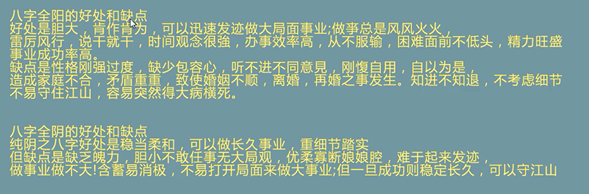

# 吉神、恶神

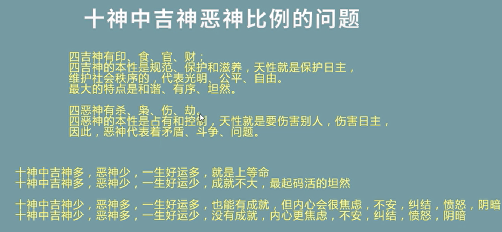

# 喜忌比例

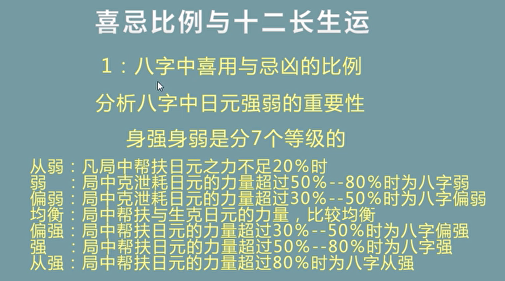

# 天干五合和天干四冲

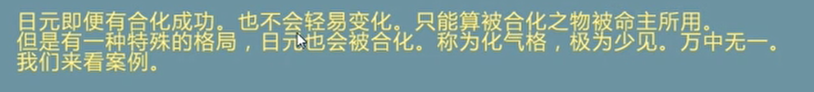

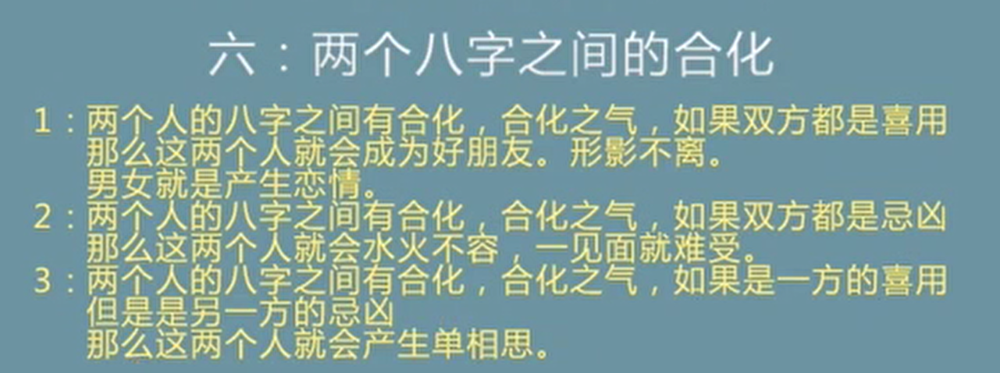

# 地支三合、六合

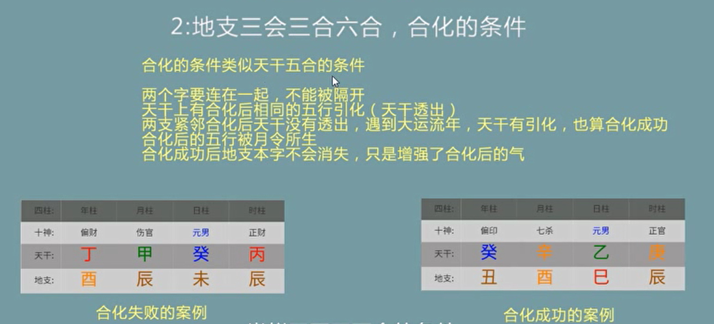

# 地支三刑

# 地支六冲

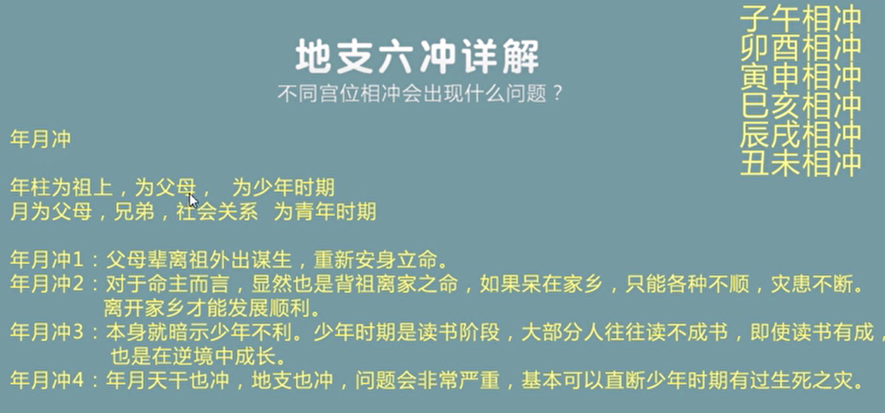

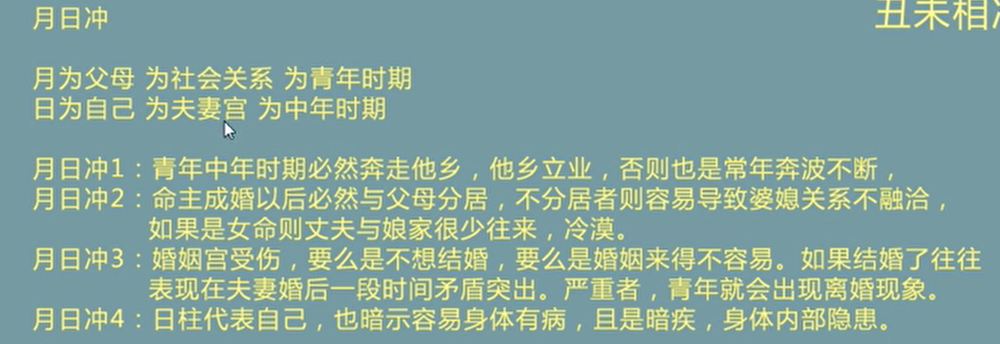

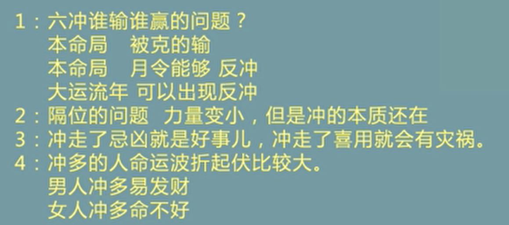

# 地支六害、六破

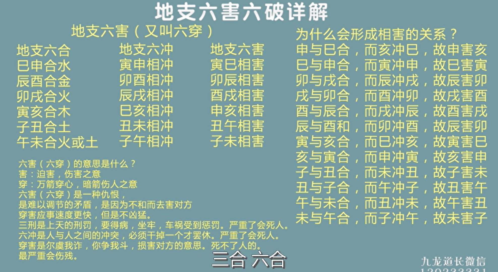

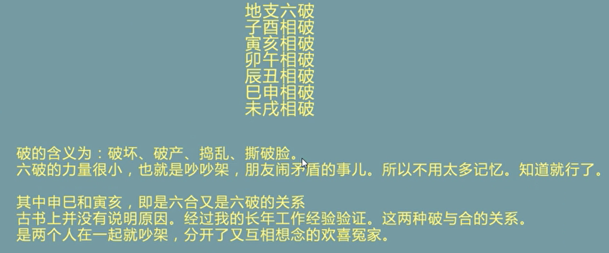

# 八字看婚姻感情

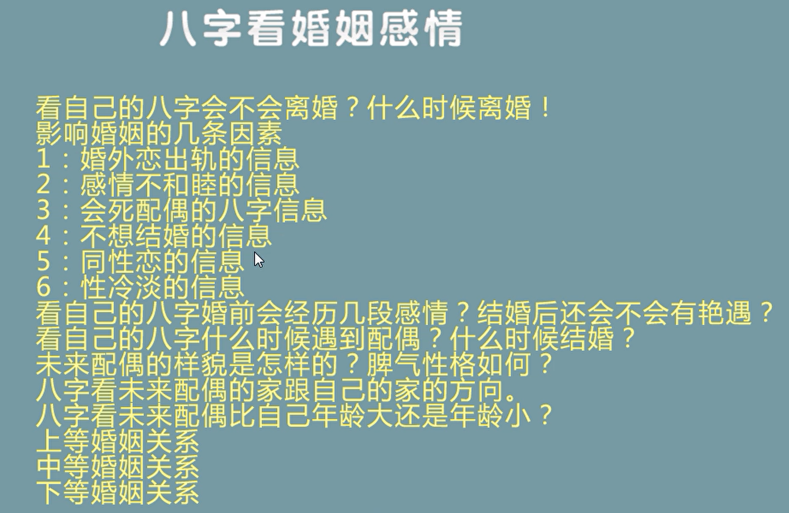

# 日元强弱7种状态详解

## 传统派

