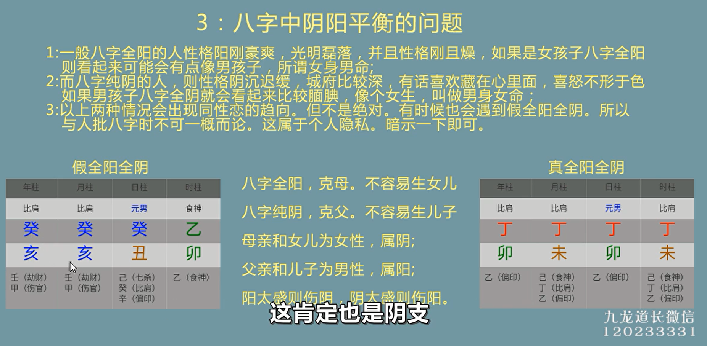
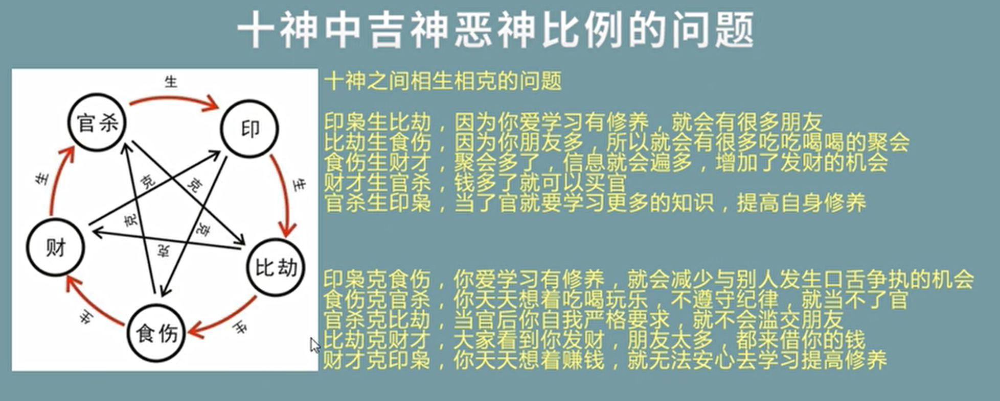
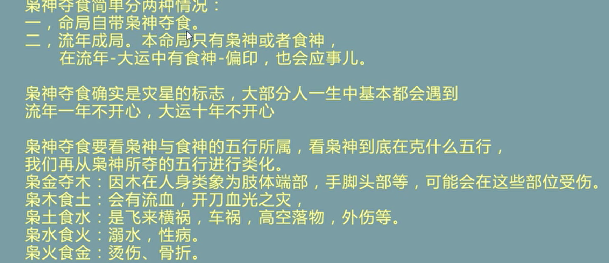
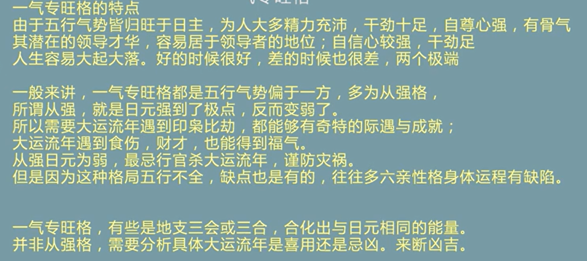
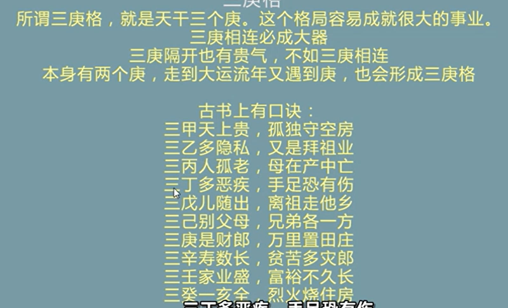
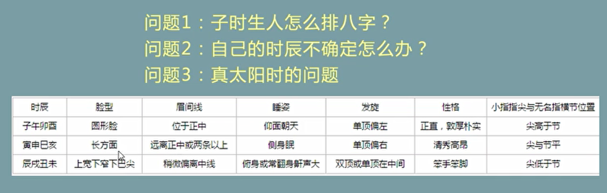

# 何为八字

排八字

# 批八字注意事项

- 必须要收费

不带偏印，太极，天乙贵人，辰戌丑未着不看

# 五行

# 天干地支

天干主动、地支主静

意象

六十甲子

天干只与天干作用，地支只与地支作用

# 十神

意象

# 十二长生

# 刑冲合化

# 首先铁口直断三件事，取得命主的信任

# 批八字流程

空亡：某些方面的缺失

# 如何看一个人何时发财

# 如何挑选一个旺财的手机号

# 评判八字好坏的6个标准

## 五行平衡

八字五行不平衡的坏处：

性格的缺失

生命运程轨迹不顺畅

克六亲

## 燥湿平衡

## 阴阳平衡

# 吉神、恶神

# 喜忌比例

# 天干五合和天干四冲

# 地支三合、六合

# 地支三刑

# 地支六冲

# 地支六害、六破

# 八字看婚姻感情

# 日元强弱7种状态详解

## 传统派

## 身强身弱代表什么？

自信心

自身的能量

身强才有财运

# 八字看自己的身体疾病

# 八字看六亲的疾病

# 八字常见格局

## 天元一气

## 杀印相生

## 食神制杀

## 身杀两停

## 伤官配印

## 伤官生财

## 伤官见官

## 伤官泄秀

## 枭神夺食

## 天地鸳鸯合

## 一气专旺

## 日贵格

天乙贵人

## 三庚格

# 常见问题总结

## 真太阳时

## 时辰不确定

# 袁天罡称骨算命

# 空亡

